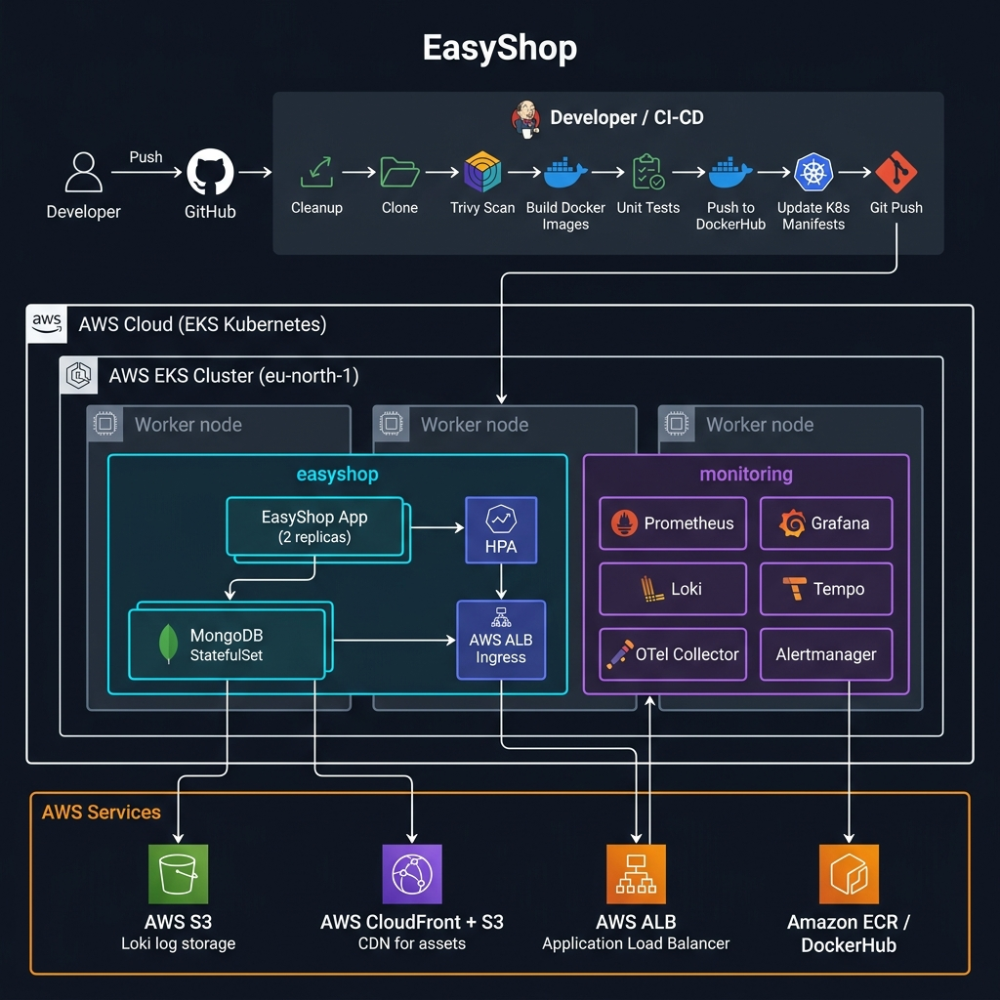
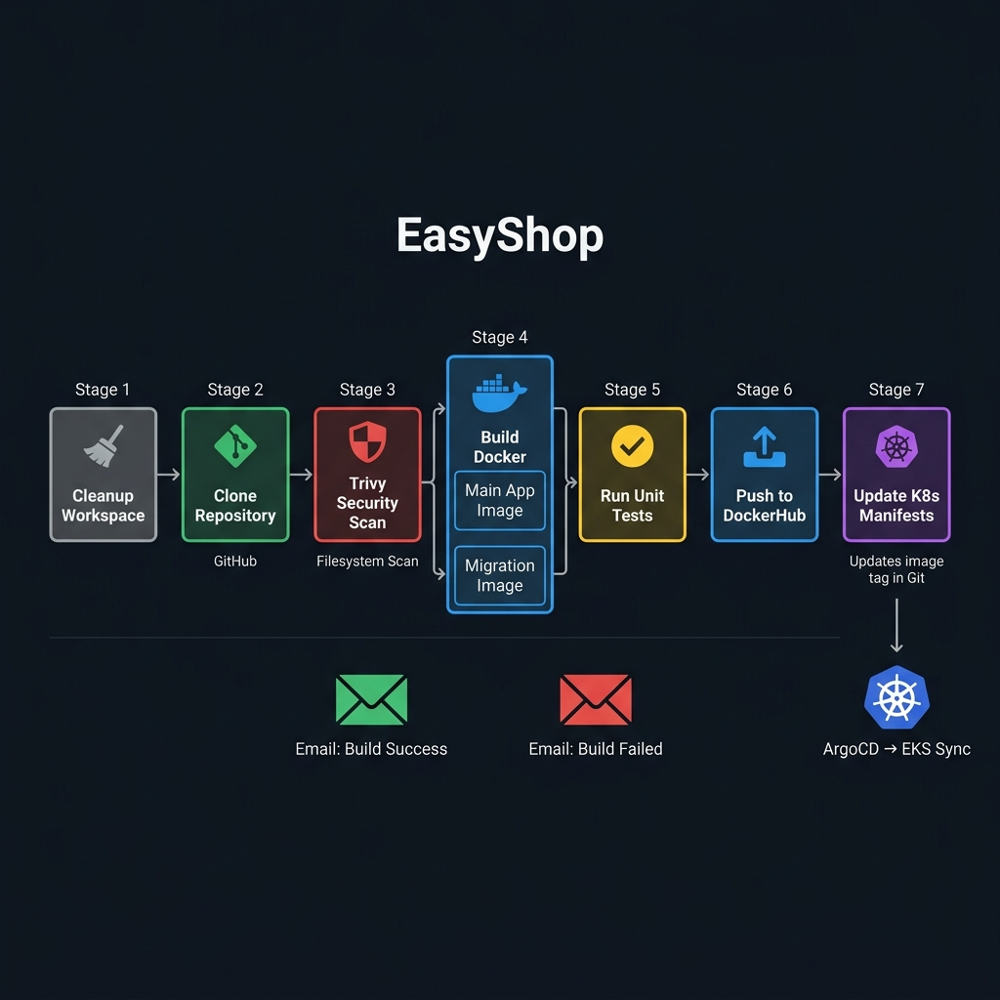
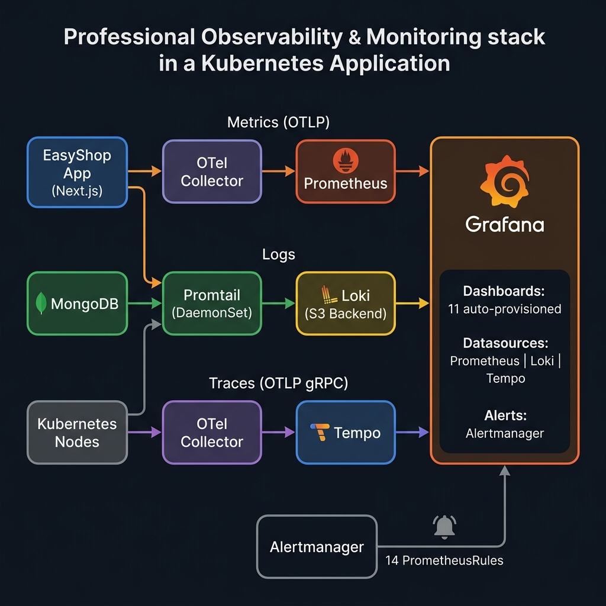

<div align="center">

# 🛍️ EasyShop — Production-Ready E-Commerce on AWS EKS

**A full-stack Next.js e-commerce application deployed on AWS EKS with a complete DevSecOps pipeline, observability stack, and auto-scaling.**

[](https://hub.docker.com/r/subhanshu12/e-shop-app)
[](https://kubernetes.io)
[](https://aws.amazon.com/eks/)
[](https://jenkins.io)
[](https://grafana.com)
[](https://prometheus.io)
[](https://nextjs.org)
[](https://mongodb.com)

</div>

---

## 📋 Table of Contents

- [Overview](#-overview)
- [Architecture](#-architecture)
- [Tech Stack](#-tech-stack)
- [Project Structure](#-project-structure)
- [CI/CD Pipeline](#-cicd-pipeline-jenkins)
- [Kubernetes Manifests](#-kubernetes-manifests)
- [Observability Stack](#-observability-stack)
- [Infrastructure (Terraform)](#-infrastructure-terraform)
- [Prerequisites](#-prerequisites)
- [Quick Start](#-quick-start)
- [Deployment Guide](#-deployment-guide)
- [Monitoring & Access URLs](#-monitoring--access-urls)
- [Alerting Rules](#-alerting-rules)
- [Security](#-security)
- [Contributing](#-contributing)

---

## 🌟 Overview

EasyShop is a production-ready e-commerce platform built with **Next.js 14** and deployed on **AWS EKS**. The project demonstrates enterprise-grade DevOps practices:

| Feature | Implementation |
|---------|---------------|
| 🏗️ **Infrastructure as Code** | Terraform (EC2 Jenkins server, S3, CloudFront CDN) |
| 🔄 **CI/CD Pipeline** | Jenkins with 7 stages — Scan → Build → Test → Push → Deploy |
| 🐳 **Containerization** | Multi-stage Docker builds (Builder + Production runner) |
| ☸️ **Orchestration** | AWS EKS (3 worker nodes, `eu-north-1`) |
| 📈 **Auto-scaling** | Kubernetes HPA based on CPU/memory |
| 🔍 **Security Scanning** | Trivy filesystem scan on every build |
| 📊 **Observability** | Prometheus + Grafana + Loki + Tempo + OTel Collector |
| 🚀 **CDN** | AWS CloudFront + S3 for static assets |

---

## 🏛️ Architecture



### Data Flow

```
Developer → GitHub → Jenkins CI/CD
                          │
                ┌─────────▼──────────┐
                │   Build & Test     │
                │   Docker Images    │
                │   Security Scan    │
                └─────────┬──────────┘
                          │ Push to DockerHub
                          │ Update K8s manifests in Git
                          ▼
              ┌────────────────────────┐
              │   AWS EKS Cluster      │
              │   eu-north-1           │
              │                        │
              │  ┌──────────────────┐  │
              │  │  easyshop ns     │  │
              │  │  Next.js App x2  │  │
              │  │  MongoDB         │  │
              │  │  AWS ALB Ingress │  │
              │  └──────────────────┘  │
              │                        │
              │  ┌──────────────────┐  │
              │  │  monitoring ns   │  │
              │  │  Prometheus      │  │
              │  │  Grafana         │  │
              │  │  Loki + S3       │  │
              │  │  Tempo           │  │
              │  │  OTel Collector  │  │
              │  └──────────────────┘  │
              └────────────────────────┘
```

---

## 🛠️ Tech Stack

### Application
| Layer | Technology |
|-------|-----------|
| **Frontend** | Next.js 14, React 18, TypeScript |
| **Styling** | Tailwind CSS, shadcn/ui |
| **State** | Redux Toolkit |
| **Auth** | NextAuth.js |
| **Database** | MongoDB (StatefulSet on EKS) |
| **CDN** | AWS CloudFront + S3 |

### DevOps & Infrastructure
| Category | Tools |
|----------|-------|
| **CI/CD** | Jenkins (EC2 t2.medium, Ubuntu 24.04) |
| **Containers** | Docker (multi-stage), DockerHub |
| **Orchestration** | AWS EKS v1.30, kubectl |
| **Ingress** | AWS ALB Ingress Controller |
| **IaC** | Terraform (EC2, S3, CloudFront) |
| **Security** | Trivy (filesystem scan) |
| **Registry** | DockerHub (`subhanshu12/e-shop-app`) |

### Observability
| Tool | Purpose |
|------|---------|
| **Prometheus** | Metrics collection & alerting rules |
| **Grafana** | Dashboards, datasource unification |
| **Loki** | Log aggregation (S3 backend) |
| **Promtail** | Log shipping DaemonSet |
| **Tempo** | Distributed tracing (OTLP) |
| **OTel Collector** | Telemetry routing (Deployment mode) |
| **Alertmanager** | Alert routing & notification |

---

## 📁 Project Structure

```
production-ready-e-commerce-application-1/
├── 📄 Dockerfile                    # Multi-stage production build
├── 📄 Jenkinsfile                   # CI/CD pipeline definition
├── 📄 docker-compose.yml            # Local development
├── 📄 next.config.js                # Next.js + CDN config
│
├── 📁 src/
│   ├── 📁 app/                      # Next.js App Router pages
│   ├── 📁 components/               # Reusable UI components
│   ├── 📁 lib/
│   │   ├── db.ts                    # MongoDB connection
│   │   ├── models/                  # Mongoose models
│   │   ├── features/                # Redux slices
│   │   └── store.ts                 # Redux store
│   └── 📁 types/                    # TypeScript type definitions
│
├── 📁 kubernetes/
│   ├── 01-namespace.yaml            # easyshop namespace
│   ├── 02-mongodb-pv.yaml           # PersistentVolume
│   ├── 03-mongodb-pvc.yaml          # PersistentVolumeClaim
│   ├── 04-configmap.yaml            # App config (CDN URL, API URL)
│   ├── 05-secrets.yaml              # Credentials (base64 encoded)
│   ├── 06-mongodb-service.yaml      # MongoDB ClusterIP service
│   ├── 07-mongodb-statefulset.yaml  # MongoDB StatefulSet
│   ├── 08-easyshop-deployment.yaml  # App Deployment (2 replicas)
│   ├── 09-easyshop-service.yaml     # App ClusterIP service
│   ├── 10-ingress.yaml              # AWS ALB Ingress
│   ├── 11-hpa.yaml                  # HorizontalPodAutoscaler
│   ├── 12-migration-job.yaml        # DB migration Job
│   │
│   └── 📁 monitoring/
│       ├── 📁 values/
│       │   ├── prometheus-values.yaml   # kube-prometheus-stack config
│       │   ├── loki-values.yaml         # Loki + S3 backend config
│       │   ├── tempo-values.yaml        # Tempo tracing config
│       │   └── otel-values.yaml         # OTel Collector config
│       ├── 📁 ingress/
│       │   ├── grafana-ingress.yaml     # Grafana ALB Ingress
│       │   ├── prometheus-ingress.yaml  # Prometheus UI Ingress
│       │   └── tempo-ingress.yaml       # Tempo UI Ingress
│       ├── 📁 dashboards/
│       │   └── easyshop-overview.yaml   # Custom dashboard ConfigMap
│       ├── 📁 datasources/
│       │   └── grafana-datasources.yaml # All 3 datasources ConfigMap
│       ├── servicemonitor.yaml          # ServiceMonitor + PodMonitor
│       ├── alerting-rules.yaml          # 14 PrometheusRules
│       └── deploy-monitoring.sh         # Bootstrap deploy script
│
├── 📁 terraform/
│   ├── ec2.tf                       # Jenkins EC2 instance
│   ├── s3_cdn.tf                    # S3 bucket + CloudFront CDN
│   ├── provider.tf                  # AWS provider config
│   └── variables.tf                 # Input variables
│
└── 📁 scripts/
    └── Dockerfile.migration         # DB migration container
```

---

## 🔄 CI/CD Pipeline (Jenkins)



Jenkins runs on a dedicated **EC2 instance** (provisioned via Terraform) and executes 7 stages on every push to `main`:

### Pipeline Stages

#### Stage 1 — Cleanup Workspace
Clears the Jenkins workspace to ensure a clean build environment.

#### Stage 2 — Clone Repository
```groovy
git branch: 'main', credentialsId: 'github-credentials',
    url: 'https://github.com/subhanshu12/Ecommerce-3trial-project.git'
```

#### Stage 3 — Trivy Security Scan
```bash
trivy fs --exit-code 0 --severity HIGH,CRITICAL --format table .
```
Scans the filesystem for vulnerabilities **before** building images. Does not fail the build (exit-code 0) — reports findings.

#### Stage 4 — Build Docker Images (parallel)
Two images built in parallel:
- **Main App**: `subhanshu12/e-shop-app:${BUILD_NUMBER}` — multi-stage Next.js build
- **Migration**: `subhanshu12/e-shop-migration:${BUILD_NUMBER}` — DB migration runner

**Dockerfile highlights:**
```dockerfile
# Stage 1: Builder
FROM node:18-alpine AS builder
RUN apk add --no-cache python3 make g++ libc6-compat
RUN npm ci && npm run build

# Stage 2: Production (minimal image)
FROM node:18-alpine AS runner
ENV NODE_ENV=production
USER node   # Non-root user for security
CMD ["node", "server.js"]
```

#### Stage 5 — Run Unit Tests
Executes the test suite against the built application.

#### Stage 6 — Push to DockerHub (parallel)
Both images pushed to DockerHub with the `BUILD_NUMBER` as the image tag.

#### Stage 7 — Update Kubernetes Manifests
Automatically updates the image tag in `kubernetes/08-easyshop-deployment.yaml` and commits back to GitHub. This triggers the next deployment.

#### Post Actions
- ✅ **Success**: Email notification with build details
- ❌ **Failure**: Email notification with error details

> **Note:** Jenkins only handles build/test/push. It does **NOT** directly call `kubectl` or `helm` into EKS — that would require exposing the cluster API. The manifests are updated in Git and applied separately via `kubectl apply`.

---

## ☸️ Kubernetes Manifests

### Namespace Layout

```
easyshop namespace
├── ConfigMap (easyshop-config)      — CDN URL, MongoDB URI, API URLs
├── Secret (easyshop-secrets)        — DB credentials, NextAuth secret
├── StatefulSet: mongodb             — MongoDB with PV/PVC
├── Deployment: easyshop (2 replicas)
├── Service: easyshop-service (ClusterIP :80)
├── HPA: easyshop-hpa                — scales 2–5 replicas
├── Ingress: AWS ALB (internet-facing)
└── Job: db-migration                — one-time schema migration
```

### Deploy the Application

```bash
# Apply all manifests in order
kubectl apply -f kubernetes/

# Verify everything is running
kubectl get all -n easyshop

# Watch rollout
kubectl rollout status deployment/easyshop -n easyshop
```

### Horizontal Pod Autoscaler

The HPA automatically scales the `easyshop` deployment:

| Metric | Target | Min Replicas | Max Replicas |
|--------|--------|-------------|-------------|
| CPU | 70% | 2 | 5 |
| Memory | 80% | 2 | 5 |

### Environment Variables (ConfigMap)

| Key | Value |
|-----|-------|
| `MONGODB_URI` | `mongodb://mongodb-service:27017/easyshop` |
| `CDN_URL` | `https://d1k2vzv1k2d2me.cloudfront.net` |
| `NODE_ENV` | `production` |
| `NEXT_PUBLIC_API_URL` | AWS ALB URL + `/api` |
| `NEXTAUTH_URL` | AWS ALB URL |

---

## 📊 Observability Stack



The full observability stack is deployed in the `monitoring` namespace using Helm charts.

### Components

| Component | Helm Chart | Version | Purpose |
|-----------|-----------|---------|---------|
| Prometheus | `kube-prometheus-stack` | 87.x | Metrics scraping + alerting |
| Grafana | (bundled) | — | Dashboards + visualization |
| Alertmanager | (bundled) | — | Alert routing |
| Loki | `grafana/loki` | 6.x | Log aggregation (S3 backend) |
| Promtail | (bundled) | — | Log shipping DaemonSet |
| Tempo | `grafana/tempo` | 1.24.x | Distributed tracing (OTLP) |
| OTel Collector | `opentelemetry-collector` | 0.105 | Telemetry routing |

### Install the Monitoring Stack

```bash
# 1. Add Helm repos
helm repo add prometheus-community https://prometheus-community.github.io/helm-charts
helm repo add grafana https://grafana.github.io/helm-charts
helm repo add open-telemetry https://open-telemetry.github.io/opentelemetry-helm-charts
helm repo update

# 2. Create namespace
kubectl create namespace monitoring

# 3. Install kube-prometheus-stack (Prometheus + Grafana + Alertmanager)
helm upgrade --install monitoring prometheus-community/kube-prometheus-stack \
  -n monitoring \
  --values kubernetes/monitoring/values/prometheus-values.yaml \
  --wait --timeout 10m

# 4. Install Loki + Promtail (S3 backend)
helm upgrade --install loki grafana/loki \
  -n monitoring \
  --values kubernetes/monitoring/values/loki-values.yaml \
  --wait --timeout 8m

# 5. Install Tempo
helm upgrade --install tempo grafana/tempo \
  -n monitoring \
  --values kubernetes/monitoring/values/tempo-values.yaml \
  --wait --timeout 5m

# 6. Install OpenTelemetry Collector
helm upgrade --install otel-collector open-telemetry/opentelemetry-collector \
  -n monitoring \
  --values kubernetes/monitoring/values/otel-values.yaml \
  --wait --timeout 5m

# 7. Apply Kubernetes CRDs (ServiceMonitor, AlertRules, Ingress)
kubectl apply -f kubernetes/monitoring/servicemonitor.yaml
kubectl apply -f kubernetes/monitoring/alerting-rules.yaml
kubectl apply -f kubernetes/monitoring/ingress/
kubectl apply -f kubernetes/monitoring/datasources/
kubectl apply -f kubernetes/monitoring/dashboards/
```

Or use the bootstrap script:
```bash
chmod +x kubernetes/monitoring/deploy-monitoring.sh
./kubernetes/monitoring/deploy-monitoring.sh
```

### Loki S3 Backend

Logs are stored in **AWS S3** for durability (not on ephemeral pod storage):

```yaml
# loki-values.yaml
loki:
  storage:
    type: s3
    bucketNames:
      chunks: easyshop-loki-logs-022599238981
    s3:
      region: eu-north-1
```

IAM policy for Loki service account (`loki-s3-policy.json`):
```json
{
  "Statement": [
    { "Action": ["s3:ListBucket"], "Resource": "arn:aws:s3:::easyshop-loki-logs-022599238981" },
    { "Action": ["s3:GetObject","s3:PutObject","s3:DeleteObject"], "Resource": "arn:aws:s3:::easyshop-loki-logs-022599238981/*" }
  ]
}
```

### Auto-Provisioned Grafana Dashboards (11)

All dashboards are provisioned automatically from Grafana.com — no manual import needed:

| Dashboard | Grafana ID | Category |
|-----------|-----------|----------|
| Kubernetes Cluster Overview | 7249 | Infrastructure |
| Node Exporter Full | 1860 | Infrastructure |
| Kubernetes Pods | 6417 | Infrastructure |
| Namespace Resource Usage | 15758 | Infrastructure |
| NGINX Ingress Controller | 9614 | Infrastructure |
| Loki Logs | 13639 | Logging |
| Alertmanager Overview | 9578 | Alerting |
| Argo CD | 14584 | GitOps |
| Jenkins | 9964 | CI/CD |
| MongoDB | 7353 | Database |
| Kubernetes API Server | 12006 | Infrastructure |
| EasyShop Overview (custom) | local | Application |

### Telemetry Data Flow

```
EasyShop App
    │
    ├──── Metrics (OTLP) ──────→ OTel Collector ──→ Prometheus ──→ Grafana
    │
    ├──── Logs ────────────────→ Promtail ──────────→ Loki (S3) ──→ Grafana
    │
    └──── Traces (OTLP gRPC) ──→ OTel Collector ──→ Tempo ────────→ Grafana
```

---

## 🏗️ Infrastructure (Terraform)

### Jenkins EC2 Server

```hcl
# terraform/ec2.tf
resource "aws_instance" "testinstance" {
  ami           = data.aws_ami.os_image.id  # Ubuntu 24.04 LTS
  instance_type = var.instance_type          # t2.medium
  key_name      = aws_key_pair.deployer.key_name
  user_data     = file("install_tools.sh")   # Auto-installs Jenkins, Docker, kubectl
  root_block_device {
    volume_size = 30  # GB
    volume_type = "gp3"
  }
}
```

Security group allows: SSH (22), HTTP (80), HTTPS (443), Jenkins (8080).

### S3 + CloudFront CDN

```hcl
# terraform/s3_cdn.tf
# S3 bucket for static assets
# CloudFront distribution in front of S3
# Origin Access Identity for secure S3 access
```

Assets served via CloudFront for global low-latency delivery:
- CDN URL: `https://d1k2vzv1k2d2me.cloudfront.net`

### Provision Infrastructure

```bash
cd terraform/

# Initialize Terraform
terraform init

# Preview changes
terraform plan

# Apply
terraform apply -auto-approve

# Get Jenkins server IP
terraform output instance_public_ip
```

---

## 📋 Prerequisites

### Local Development
- Node.js 18+
- Docker & Docker Compose
- MongoDB (or use docker-compose)

### Deployment
- AWS Account with permissions for EKS, EC2, S3, CloudFront
- `kubectl` configured for your EKS cluster
- `helm` v3.x
- `terraform` v1.x
- DockerHub account

### AWS Services Required
- EKS Cluster (3 nodes, `eu-north-1`)
- EC2 (Jenkins server — provisioned by Terraform)
- S3 Bucket (Loki log storage)
- S3 + CloudFront (CDN — provisioned by Terraform)
- AWS ALB Ingress Controller (installed on EKS)

---

## ⚡ Quick Start

### Local Development

```bash
# Clone the repository
git clone https://github.com/subhanshu12/Ecommerce-3trial-project.git
cd Ecommerce-3trial-project

# Copy environment file
cp .env.example .env
# Edit .env with your MongoDB URI and NextAuth secret

# Start with Docker Compose
docker-compose up -d

# Or run locally
npm install
npm run dev
```

Open [http://localhost:3000](http://localhost:3000)

### Docker Build

```bash
# Build production image
docker build -t subhanshu12/e-shop-app:latest .

# Run container
docker run -p 3000:3000 \
  -e MONGODB_URI="mongodb://localhost:27017/easyshop" \
  -e NEXTAUTH_SECRET="your-secret" \
  subhanshu12/e-shop-app:latest
```

---

## 🚀 Deployment Guide

### Step 1: Provision Jenkins EC2

```bash
cd terraform
terraform init && terraform apply
# Note the Jenkins EC2 public IP from output
```

### Step 2: Configure Jenkins

1. Access Jenkins at `http://<EC2-IP>:8080`
2. Install plugins: Pipeline, Docker Pipeline, Email Extension
3. Add credentials:
   - `github-credentials` — GitHub token
   - `dockerhub-credentials` — DockerHub username/password
   - `gmail-credentials` — SMTP credentials for email notifications
4. Create Pipeline job pointing to this repository's `Jenkinsfile`

### Step 3: Configure EKS

```bash
# Update kubeconfig
aws eks update-kubeconfig --region eu-north-1 --name <your-cluster-name>

# Install AWS ALB Ingress Controller
helm repo add eks https://aws.github.io/eks-charts
helm install aws-load-balancer-controller eks/aws-load-balancer-controller \
  -n kube-system \
  --set clusterName=<your-cluster-name> \
  --set serviceAccount.create=true
```

### Step 4: Deploy Application

```bash
# Create secrets (update values first!)
kubectl apply -f kubernetes/05-secrets.yaml

# Deploy everything
kubectl apply -f kubernetes/

# Verify
kubectl get all -n easyshop
```

### Step 5: Deploy Monitoring Stack

```bash
chmod +x kubernetes/monitoring/deploy-monitoring.sh
./kubernetes/monitoring/deploy-monitoring.sh
```

---

## 🔗 Monitoring & Access URLs

After deployment, the following URLs are available:

| Service | URL | Credentials |
|---------|-----|-------------|
| **EasyShop App** | `http://<ALB-URL>` | — |
| **Grafana** | `http://grafana.<ALB-IP>.nip.io` | admin / EasyShop@Grafana2024! |
| **Prometheus** | `http://prometheus.<ALB-IP>.nip.io` | — |
| **Alertmanager** | `http://alertmanager.<ALB-IP>.nip.io` | — |

### Port-Forward (Local Access)

```bash
# Grafana
kubectl port-forward svc/monitoring-grafana 3000:80 -n monitoring
# → http://localhost:3000

# Prometheus
kubectl port-forward svc/monitoring-kube-prometheus-prometheus 9090:9090 -n monitoring
# → http://localhost:9090

# Alertmanager
kubectl port-forward svc/monitoring-kube-prometheus-alertmanager 9093:9093 -n monitoring
# → http://localhost:9093
```

---

## 🚨 Alerting Rules

14 PrometheusRules defined in `kubernetes/monitoring/alerting-rules.yaml`:

### Application Alerts
| Alert | Severity | Condition |
|-------|----------|-----------|
| `EasyShopDown` | 🔴 Critical | 0 available replicas for 1m |
| `EasyShopDeploymentDegraded` | 🟡 Warning | < desired replicas for 5m |
| `EasyShopPodCrashLooping` | 🟡 Warning | > 6 restarts in 1h |
| `EasyShopPodNotReady` | 🟡 Warning | Pod not Ready for 5m |
| `EasyShopHighMemoryUsage` | 🟡 Warning | Memory > 450Mi |
| `EasyShopMemoryNearLimit` | 🔴 Critical | Memory > 90% of 512Mi limit |
| `EasyShopHighCPUThrottling` | 🟡 Warning | CPU throttled > 80% |

### Database Alerts
| Alert | Severity | Condition |
|-------|----------|-----------|
| `MongoDBDown` | 🔴 Critical | 0 ready replicas |
| `MongoDBPodRestarting` | 🟡 Warning | Restart rate > 0 for 10m |

### Infrastructure Alerts
| Alert | Severity | Condition |
|-------|----------|-----------|
| `NodeMemoryPressure` | 🔴 Critical | Node memory pressure |
| `NodeDiskPressure` | 🔴 Critical | Node disk pressure |
| `NodeDiskUsageHigh` | 🟡 Warning | Disk > 85% |
| `KubernetesJobFailed` | 🟡 Warning | Failed migration job |
| `HPAAtMaxReplicas` | 🟡 Warning | HPA at max for 10m+ |

---

## 🔒 Security

| Area | Implementation |
|------|---------------|
| **Image Scanning** | Trivy scans every build for HIGH/CRITICAL CVEs |
| **Non-root Container** | Dockerfile runs as `node` user (not root) |
| **Secrets** | Kubernetes Secrets (base64 encoded, not in Git) |
| **Network** | EKS security groups, ALB in public subnet only |
| **RBAC** | Service accounts with least-privilege IAM roles |
| **S3** | CloudFront Origin Access Identity (no direct S3 access) |

> ⚠️ **Important**: Never commit real credentials to Git. The `05-secrets.yaml` file should be in `.gitignore` or use a secrets manager (AWS Secrets Manager / Vault) in production.

---

## 📁 Environment Variables

### Required in Kubernetes Secrets (`05-secrets.yaml`)

```yaml
data:
  MONGODB_USERNAME: <base64>
  MONGODB_PASSWORD: <base64>
  NEXTAUTH_SECRET: <base64>
  JWT_SECRET: <base64>
```

### Required in `.env` (local development)

```env
MONGODB_URI=mongodb://localhost:27017/easyshop
NEXTAUTH_SECRET=your-dev-secret
NEXTAUTH_URL=http://localhost:3000
CDN_URL=http://localhost:3000
```

---

## 🤝 Contributing

1. Fork the repository
2. Create a feature branch: `git checkout -b feat/your-feature`
3. Commit your changes: `git commit -m 'feat: add some feature'`
4. Push to the branch: `git push origin feat/your-feature`
5. Open a Pull Request

### Commit Convention

```
feat:     New feature
fix:      Bug fix
refactor: Code refactoring
docs:     Documentation changes
ci:       CI/CD changes
infra:    Infrastructure changes
```

---

## 📄 License

This project is for educational and demonstration purposes.

---

<div align="center">

**Built with ❤️ by [Subhanshu Tripathi](https://github.com/subhanshu12)**

⭐ Star this repo if you found it helpful!

</div>
